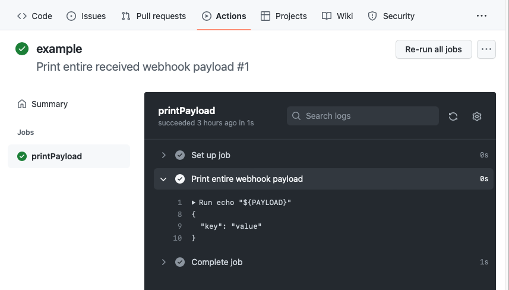

# GitHub Actions Webhook CLI #

This example target provides a command-line interface for sending a webhook event to a GitHub Actions workflow.

This example should always be executed from inside this directory (since it searches for a configuration file here).

## Quick start ##

At the end of this quick start, you should be able to receive your arbitrary payload in a GitHub Actions workflow in your own repository, like below:

<picture>
	<source media="(prefers-color-scheme: dark)" srcset="example-workflow-dark.png">
	
</picture>

### Setup ###

1. In this directory, copy `config.example.yaml` to `config.yaml`
4. [Create a GitHub App](https://docs.github.com/en/developers/apps/building-github-apps/creating-a-github-app) in your account (alternatively use an existing app you have already created)
	- The only values you need to fill in is the app name and URL (which can be your GitHub profile URL), and you can uncheck `Active` under `Webhook`
	- Under `Repository permissions`, then `Contents`, grant `Read and write` permissions (this allows invoking an Actions webhook)
5. After successful creation, copy the `App ID` value and replace the example value for the key `appId` in `config.yaml`
6. At the bottom of the same page, under `Private keys`, generate a private key for your app
7. Open the generated and downloaded `.pem` file in a text editor, copy the entire contents, and replace the example value for the key `privateKey` in `config.yaml`
8. [Create a new example repository](https://github.com/new) at which to receive your webhook (alternatively reuse an existing repo you have already created)
9. Copy the repository name and replace the example value for the key `repository` in `config.yaml`
10. [Install your new app on your example repository](https://docs.github.com/en/developers/apps/managing-github-apps/installing-github-apps#installing-your-private-github-app-on-your-repository)
11. After successful installation, copy the username of the user or organization you installed the app on and replace the example value for the key `username` in `config.yaml`
12. Copy the file `print-payload.yaml` to your example repository, at the path `.github/workflows/print-payload.yaml`, then commit and push the changes

### Sending messages ###

Here are some example commands for sending messages or showing help information about the CLI:

- `swift run GithubActionsWebhookClient < payload.example.json`: send the exact example payload shown above
- `swift run GithubActionsWebhookClient --help`: print the CLI's help messages (which show what values can be configured)
- `swift run GithubActionsWebhookClient < {path/to/payload}.json`: send your own payload file
- `swift run GithubActionsWebhookClient --payload path/to/payload.json`: send your own payload file, without using shell redirection
