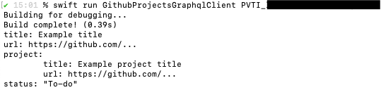

# GitHub Projects GraphQL Client #

This example target provides a command-line interface for querying the GitHub GraphQL API for details on a specific project (V2) item.

This example should always be executed from inside this directory (since it searches for a configuration file here).


## Quick start ##

At the end of this quick start, you should be able to print out details about GitHub Projects items, like below:

<picture>
	<source media="(prefers-color-scheme: dark)" srcset="example-output-dark.png">
	
</picture>


### Setup ###

1. [Install and set up the GitHub CLI tool](https://cli.github.com/manual/)
	- On macOS with Homebrew installed, you can just run:
		1. `brew install gh`
		2. `gh auth login`
2. In this directory, copy `config.example.yaml` to `config.yaml`
3. [Create a GitHub App](https://docs.github.com/en/developers/apps/building-github-apps/creating-a-github-app) in your account (alternatively use an existing app you have already created)
	- The only values you need to fill in is the app name and URL (which can be your GitHub profile URL), and you can uncheck `Active` under `Webhook`
	- Under `Organization permissions`, then `Projects`, grant `Read-only` permissions
3. After successful creation, copy the `App ID` value and replace the example value for the key `appId` in `config.yaml`
4. At the bottom of the same page, under `Private keys`, generate a private key for your app
5. Open the generated and downloaded `.pem` file in a text editor, copy the entire contents, and replace the example value for the key `privateKey` in `config.yaml`
6. [Create a new example project](https://docs.github.com/en/issues/trying-out-the-new-projects-experience/quickstart#creating-a-project) (alternatively reuse an existing project you have already created)
7. [Install your new app on the account containing the new project](https://docs.github.com/en/developers/apps/managing-github-apps/installing-github-apps#installing-your-private-github-app-on-your-repository)
8. After successful installation, copy the username of the user or organization you installed the app on and replace the example value for the key `username` in `config.yaml`
9. [Add a new draft issue to your project](https://docs.github.com/en/issues/trying-out-the-new-projects-experience/quickstart#adding-draft-issues-to-your-project)
10. Get the unique node ID for the draft issue:
	- From the URL of your new project, copy the ID of the project (`https://github.com/.../{username}/projects/{id}`)
	- Run the following command, replacing `{username}` and `{projectId}` with your corresponding values:
		```sh
		gh api graphql -f query='query {
			organization(login: "{username}") {
				projectV2(number: {projectId}) {
					id
					items(first: 1) {
						nodes {
							id
						}
					}
				}
			}
		}'
		```
	- You should receive a response like this:
		```json
		{
			"data": {
				"organization": {
					"projectV2": {
						"id": "PVT_...",
						"items": {
							"nodes": [
								{
									"id": "PVTI_..."
								}
							]
						}
					}
				}
			}
		}
		```
	- Copy the ID starting with `PVTI_` for use below


### Fetching information ###

Here are some example commands for fetching information about the project item or showing help information about the CLI:

- `swift run GithubProjectsGraphqlClient {project item ID starting with PVTI_}`: send the exact example payload shown above
- `swift run GithubProjectsGraphqlClient --help`: print the CLI's help message
